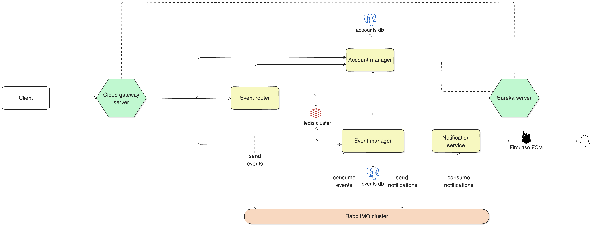
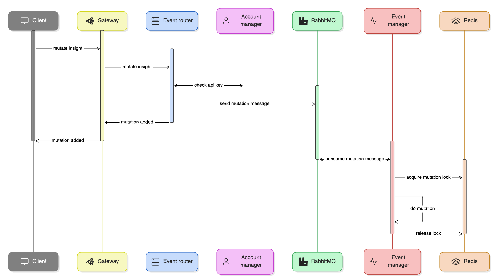

# Event Bucket

## What is it?

Event Bucket is a distributed system that allows you to track and monitor events that occur in software systems in real-time.
It provides a simple API for publishing events, linking them to specific users, and tracking relevant insights for your business.
The main focus of the application is in the API simplicity and the speed and scalability of the system.

### Main entities

- **Event**
    - the event is the base entity of the system
    - it has a name, a description, and a timestamp
    - it can be linked to a specific user / identification
- **Identification**
    - the identification is a unique identifier for a user or a system
    - it has an email address and a userId that is relevant for your software system
- **Insight**
    - the insight is a specific statistic or metric that you want to track
    - it has a name, a description and a value that can be changed over time using mutations
- **Account**
    - the account is identifying a specific user or a system
    - it has an email address and a team name
- **Project**
    - one account can have multiple projects
    - it has a name and an API key that is used to authenticate the API requests
    - every event, insight and identification must be linked to a project

## Infrastructure

The application is built using the following technologies:

- Java 21
- Spring Boot 3.3
- Spring Data JPA
- Spring Data Redis
- Spring Web
- Spring Cloud
- Spring Eureka
- Spring Cloud Gateway
- Hibernate
- RabbitMQ
- Redis
- PostgreSQL
- Docker and Docker Compose

A diagram of the application architecture is shown below:

## Project structure

The project is divided into the following modules:

- Business services:
    - event-router: handles the routing of events to the appropriate handlers
    - event-manager: handles the creation, update and deletion of events
    - account-manager: handles the creation, update and deletion of accounts
    - notification-service: handles the sending of notifications to users
- Infrastructure services:
    - eureka: provides a service registry for the microservices
    - cloud-gateway: provides the API gateway
    - infrastructure: provides the docker compose configuration for the infrastructure
- Libraries:
    - event-api: provides shared DTOs and interfaces for the event related services
    - account-api: provides shared DTOs and interfaces for the account related services
- Tests:
    - performance-tests: tests the performance of the application
- Demo:
    - frontend: provides a web view for the application

## Relevant Distributed Systems patterns

### Messaging patterns

#### Publish-Subscribe

In this pattern, a publisher sends messages to one or more subscribers. The publisher does not specify the subscribers, and the subscribers do not specify the publishers.

#### Message deduplication

In this pattern, a publisher sends a message to multiple subscribers, and the subscribers may receive the message multiple times.
The subscribers must be able to handle duplicate messages.
A message is considered duplicate if the deduplication key matches with the key of a previously received message.

#### Retry mechanism

In this pattern, a message is sent to a subscriber, and the subscriber may receive the message multiple times.
If the subscriber fails to process the message, the message is sent to another subscriber.
This process continues until the message is successfully processed or the maximum number of retries is reached.

#### Dead-letter queue

In this pattern, a message is sent to a subscriber, and the subscriber may receive the message multiple times.
If the subscriber fails to process the message, the message is sent to a dead-letter queue.
The dead-letter queue is a separate queue that stores the messages that could not be processed.

### Caching patterns

#### Distributed cache

In this pattern, a cache is a distributed data store that is accessible by multiple clients.
The cache is typically used to store frequently accessed data that should be easily and quickly accessible.

#### Server-side caching

In this pattern, a cache is managed and maintained by the server.
The server is responsible for storing and retrieving data from the cache.
The server is also responsible for managing the cache, including evicting data that is no longer needed.

### Distributed locking patterns

#### Distributed lock

In this pattern, a lock is a mechanism that allows only one client to access a resource at a time.
The lock is typically used to prevent multiple clients from modifying the same data simultaneously.

### Load balancing patterns

#### Round-robin load balancing

In this pattern, the load balancer distributes incoming requests across multiple servers in a round-robin fashion.
This ensures that no single server is overwhelmed with requests, and all servers are equally utilized.

#### Server-side load balancing

In this pattern, the load balancer is a self containing service which distributes incoming requests across multiple servers.

#### Client-side load balancing

In this pattern, the load balancer is a client-side component that distributes incoming requests across multiple servers.

### Service discovery patterns

#### Service registry

In this pattern, a service registry is a centralized database that stores information about available services.
Clients can use the service registry to discover and locate the available services.

## Flow diagrams

The following flow diagrams illustrate the inisight mutation process:

